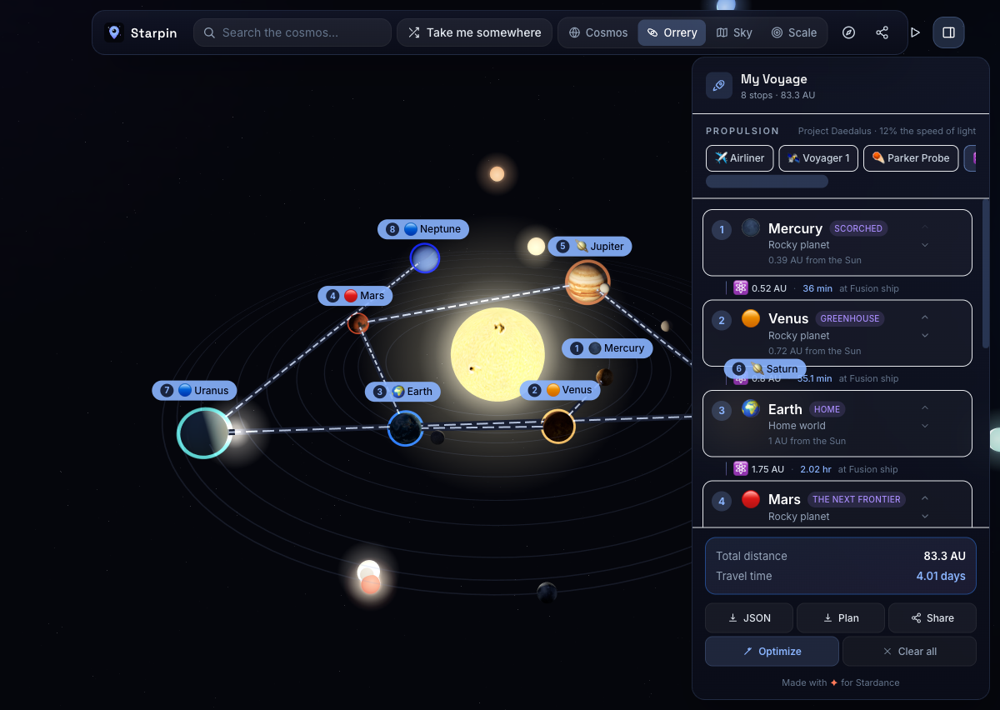
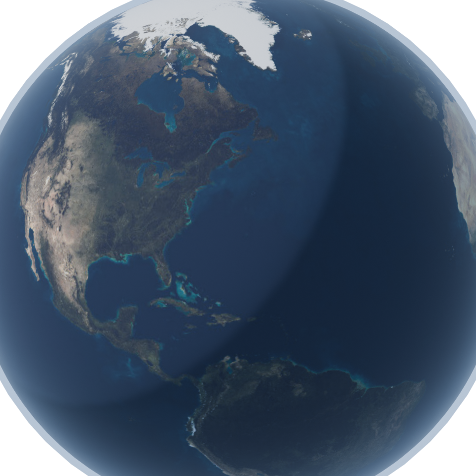
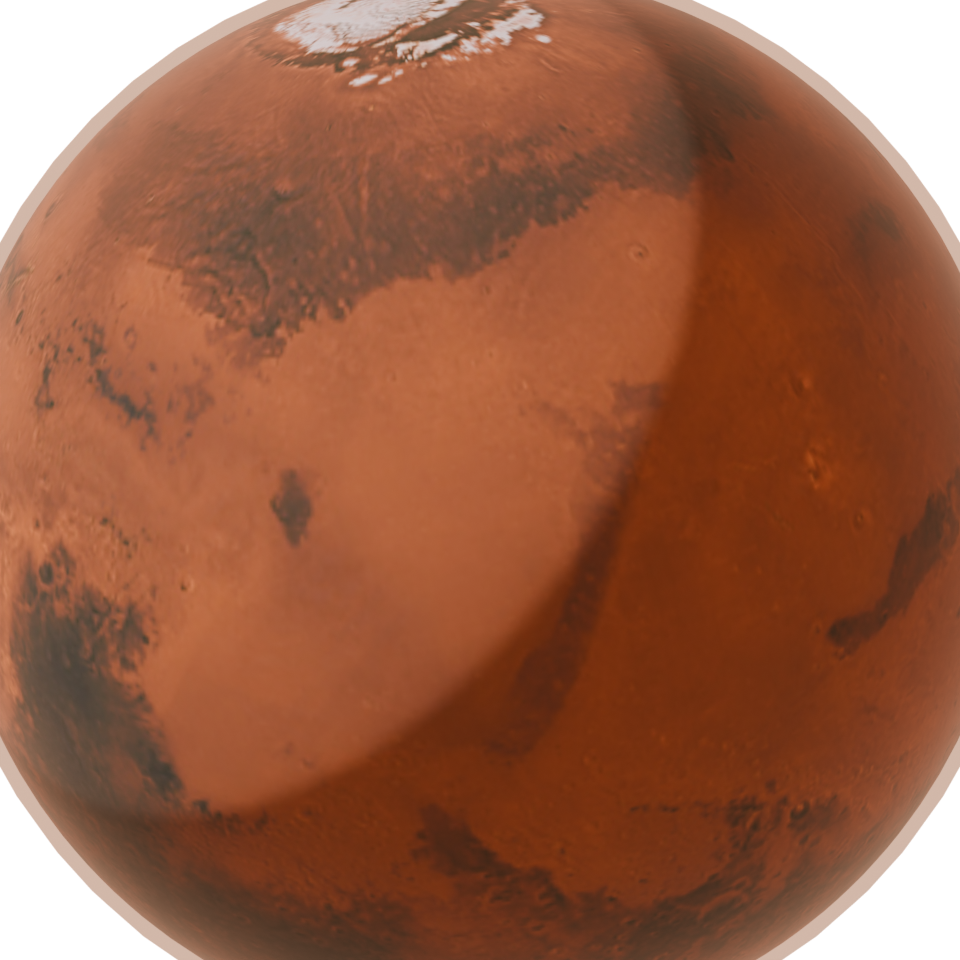
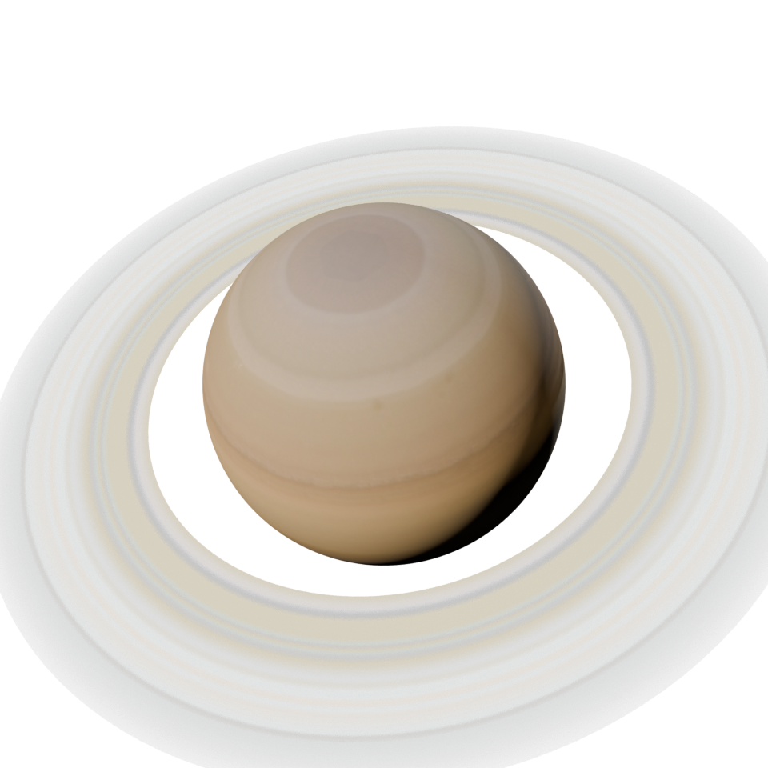

<div align="center">

# 🪐 Starpin

### Plan voyages across a living universe.

Drop pins on **real** planets, moons, stars, exoplanets, nebulae, black holes, quasars and galaxies —
chain them into an interstellar voyage, pick a propulsion system, and watch the real light‑years and
travel‑times unfold on a living, photoreal 3D cosmos.

**Built for [Stardance](https://stardance.hackclub.com) — the NASA × Hack Club summer challenge.**

[**▶ Live demo**](https://starpin.vercel.app) · [What is Stardance?](https://stardance.hackclub.com)



</div>

---

## ✨ What it is

[Wanderpin](https://wanderpin-ecru.vercel.app) lets you plan trips on a living globe. **Starpin is the same idea,
scaled up to the whole universe.** Instead of cities you pin worlds; instead of trains and flights you pick a
spacecraft; instead of kilometres you cross light‑years — and you can zoom all the way out from your back yard
to the edge of the observable universe.

## 🚀 Features

- **Photoreal planets** — every world uses real NASA/CC surface maps. Earth has drifting clouds, glowing
  night‑side cities, ocean specular and a blue atmosphere; Saturn has its rings; the gas giants their bands;
  each planet its true axial tilt. Fly up to one and it looks *real*.
- **The Scale of the Universe** — a smooth log‑zoom (inspired by [htwins.net/scale2](https://htwins.net/scale2/))
  from Earth → the Moon → the Solar System → the nearest stars → the Milky Way → the Local Group → Laniakea →
  the cosmic web → the **observable universe**, with a live `10^X m` readout the whole way out.
- **Four views** — **Cosmos** (the whole sky, log‑scaled), **Orrery** (the living Solar System), **Sky Map**
  (a flat RA/Dec star chart), and **Scale**.
- **Build a voyage** — click any world to inspect it (facts, NASA stats, and a Blender‑rendered portrait) and
  add it to your route.
- **Real travel‑times** — choose a propulsion system and every leg recomputes:
  ✈️ airliner → 🛰️ Voyager 1 → ☄️ Parker Solar Probe → ⚛️ fusion ship → 💫 10% c → ✨ light speed → 🌀 warp.
  A hop to Andromeda at Voyager's speed takes longer than the universe has existed.
- **Everything out there** — 50 destinations including the Sgr A\* and M87\* black holes, the 3C 273 and
  TON 618 quasars, the Virgo Cluster and the eerie Boötes Void.
- **Optimize, share, export** — route optimization, shareable URLs, JSON / mission‑plan exports, a guided tour.

## 🎨 Ultra‑realistic planets, rendered in Blender

The portraits in the inspector are rendered headless with **Blender (Cycles)** — real surface maps on a
sphere, a key/rim light pair for a true terminator, bump displacement, and a fresnel atmosphere shell.
Reproduce them with `blender -b -P blender/render_planets.py`.

<div align="center">

  

*Earth · Mars · Saturn — Cycles renders used as inspector heroes.*

</div>

## 🔭 The science

Distances and travel‑times are **real**; the visual map is log‑compressed so a 1‑light‑second hop to the Moon
and a 290‑million‑light‑year jump to Stephan's Quintet fit on one screen. Deep‑sky objects are placed by their
true right‑ascension / declination and distance; each leg is the straight‑line distance between two bodies,
and travel time is `distance ÷ propulsion speed`.

The catalogue was **fact‑checked** against NASA fact sheets, the NASA Exoplanet Archive, ESA Gaia and SIMBAD.

> Solar‑System distances use a fixed positional snapshot (planets move), so Earth→Mars is a representative
> ~1.7 AU. Interstellar distances are exact.

## 🛠️ Tech

React 19 · TypeScript · Vite · **three.js** + React‑Three‑Fiber + drei · Tailwind CSS · Framer Motion ·
Zustand · **Blender** (Cycles) for the planet portraits. No backend — voyages persist to `localStorage` and
shareable URLs.

## ▶ Run locally

```bash
npm install
npm run dev                          # http://localhost:5173
npm run build                        # production build → dist/
blender -b -P blender/render_planets.py   # (optional) re-render the planet portraits
```

## 📁 Structure

```
src/
  data/cosmos.ts     # 50 fact-checked destinations + preset journeys
  data/textures.ts   # planet surface-map config (maps, tilt, rings, atmosphere)
  lib/astro.ts       # coordinate math, distance & travel-time engine, formatting
  three/             # 3D scene: Planet (photoreal), Bodies, Starfield, VoyageRoute, CameraRig
  ui/                # Toolbar, Onboarding, VoyagePanel, Inspector, SkyChart, ScaleMode
  store/useVoyage.ts # Zustand state
blender/render_planets.py  # headless Cycles planet portraits
public/textures/, public/renders/
```

## 🙏 Credits

- Planet surface maps: NASA imagery via the [three.js](https://github.com/mrdoob/three.js) examples and the
  [planetpixelemporium](http://planetpixelemporium.com/planets.html) / Solar System Scope (CC‑BY) texture sets.
- Scale concept inspired by Cary & Michael Huang's [Scale of the Universe 2](https://htwins.net/scale2/).
- Astronomical data: NASA, ESA/Gaia, SIMBAD, the NASA Exoplanet Archive.

## 📝 License

MIT © 2026 Samarth Vaka — open source, as Stardance requires. Fork it, remix it, fly somewhere new.

<div align="center">
Made with ✦ for Stardance.
</div>
